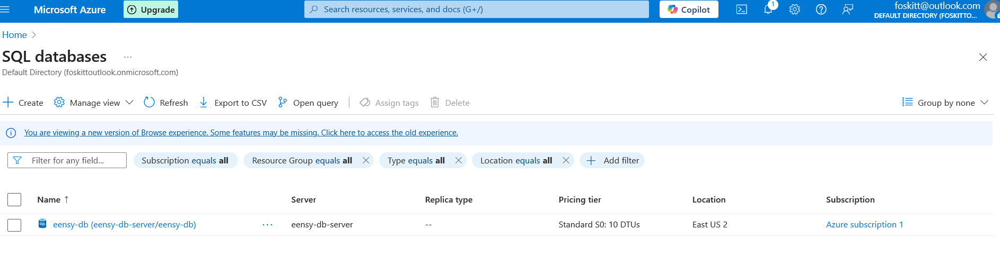



Hello, Friends -

Yay, it's "big project" day! It's called Eensy ETL. That's "Eensy" like "Eensy Teensy Weensy"; like very small. This is going to be a proof of concept project to give me some exposure to Azure. I have tons and tons of experience with AWS but literally zero with Azure. And it's also practice with data pipeline work. The last time I worked on something like this was almost a year ago.

Here is what I hope to build in this project:
1. Create a SQL database.
2. Some serverless code to collect some data from an open API - could be Python or Javascript - and load it into the database.
3. Another serverless function to clear out data older than a week - because Azure ain't free.
4. Some Java microservice to serve data from the database.

And I'll do all this with Terraform in Azure for reasons mentioned above.

Today I hammered out the Terraform for the database and applied the changes. Success! I have a database!

