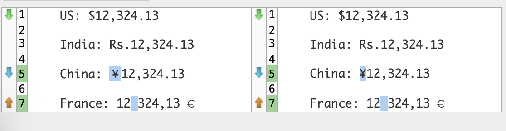



Hello, Friends -

Very straightforward day's work on this challenege today; except for a small hiccup detailed below. I worked on two HackerRank problems:
[Java String Reverse](https://www.hackerrank.com/challenges/java-string-reverse/problem?isFullScreen=true)
[Currency Formatter](https://www.hackerrank.com/challenges/java-currency-formatter/problem)

Java String Reverse is a misleading title. The instruction is to find out if a word is a palindrome and I think the title of the problem was supposed to be a clue. Though this is actually a popular interview question and the solution is very simple - `if (string equals string.reversed)` then it's a palindrome. And I did get to use a Java StringBuilder feature that accomplished this for me very succinctly.

Currency Formatter was not a misleading title, it was pretty straight forward. However, when it comes to India Locale here then things got a little interesting. The problem requires formatting currency for four countries. Three of these is easily managed with the Java Locale class. For example, pass the argument Locale.US for United States currency or Locale.CHINA for Chinese currency. However, for India this requires instantiating a new Locale instance like this:  `Locale india = new Locale("en", "IN")`  then passing that to the Java NumberFormatter class. As long as JDK is less than 19 then this is fine. For JDK 19 and above, the syntax changed to this:  `Locale india = Locale.of("en", "IN")`  This caused a small issue between the HackerRank environment (Java 8) and mine (Java 24).

Also, the Currency Formatter problem had one other issue. When I submitted this using HackerRank Java 15 then my results appeared to match the expected output - EXACTLY. However, when I ran it through text-compare.com that service noticed a difference (see screen cap below). For some reason, between Java 8 and Java 15 (the two JDK offered in the HackerRank editor), the UTF codes for a space changed (noted in the French currency output) and the UTF code for the Chinese Yuan changed (even though they look exactly the same). So for this problem, to get my solution marked correct, I had to only submit with Java 8.

Tomorrow, probably more HackerRank, maybe some Leetcode instead, it's all TBD. Stay tuned...